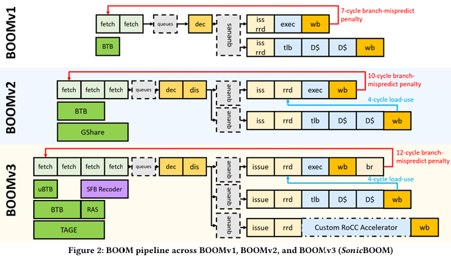

<!-- theme: uncover -->
<!-- paginate: true -->
<!-- _class: load -->

<!-- _header:"Loveyou" -->

### SonicBoom: 第三次アウトオブオーダプロセッサ

#### **Jerry Zhao, Ben Korpan, Abraham Gonzalez, Krste Asanovic**

##### 英語論文購読第２回　ヴハイナム

---

#### **Table of Content**  

1. Introduction
2. BOOM history
3. Instruction Fetch
4. Execute
5. Load-Store Unit and Data Cache
6. System support
7. Evaluation
8. What's next
9. Conclusion

---

# Introduction

* Deployment of high-performance superscalar, out-of-order (OOO) cores expanding into mobile and edge devices
* Security, power, performance, area need to be considered when evaluating new design
* An open-source hardware implementation of a superscalar, OOO core is invaluable

---

* Open source hardware implementation have numerous advantages over software models of high-performance cores
  * Demonstrate precise microarchitectural behaviors
  * Execute real applications for trillions of cycles
  * _Empirically_ provide power and area measurements
  * Point of comparison for new microarchitectural platform

---

* Most of the current open-source hardware development framework only support simple in-order cores
  * Rocket
  * Ariane
  * Black Parrot
  * PicoRV32  
* Modern mobile / server-class SOC is impossible without a full-featured, high performance implementation of a superscalar OOO core. 

---

* Based on the data in table 1, SonicBOOM is the **_fastest_ publicly available open-source** core

---

# BOOM history

---

* BOOM Version 1
  * Education tool for University
  * Based on microprocessor MIPS R10K (A RISC implementation of MIPS IV ISA)

---
