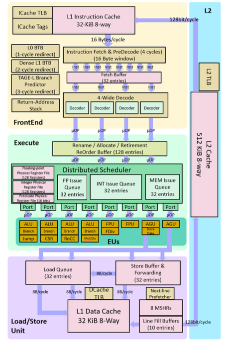

<!-- theme: uncover -->
<!-- paginate: true -->
<!-- _class: load -->
#### **SonicBOOM: The 3rd Generation Berkeley Out-of-Order Machine**
###### SonicBoom: 第三次アウトオブオーダプロセッサ
###### **Jerry Zhao, Ben Korpan, Abraham Gonzalez, Krste Asanovic**

###### 英語論文購読第２回　ヴハイナム
---
#### **Table of Content**  
1. Introduction
2. BOOM history
3. Instruction Fetch
4. Execute
5. Load-Store Unit and Data Cache
6. System support
7. Evaluation
8. What's next
9. Conclusion
---

**Introduction**
