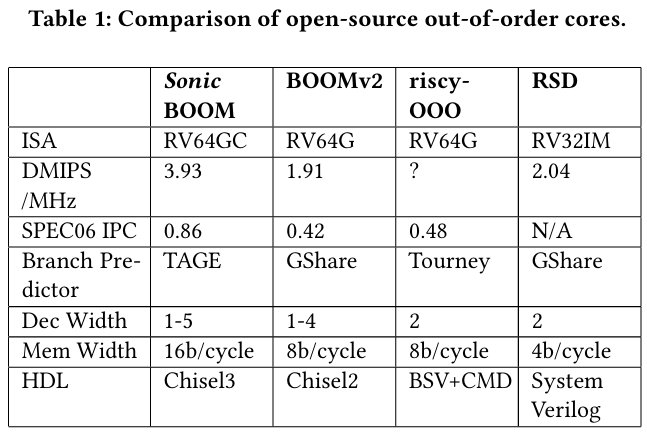
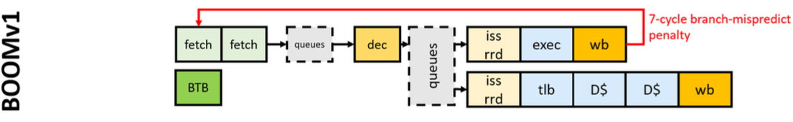
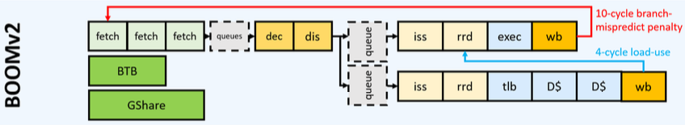
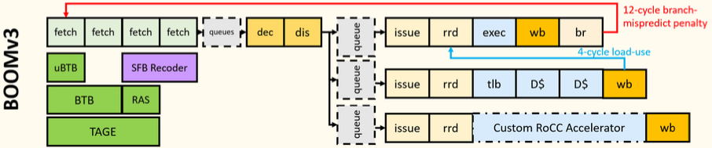
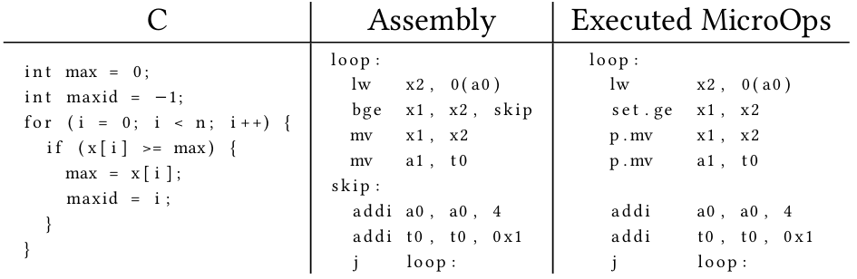
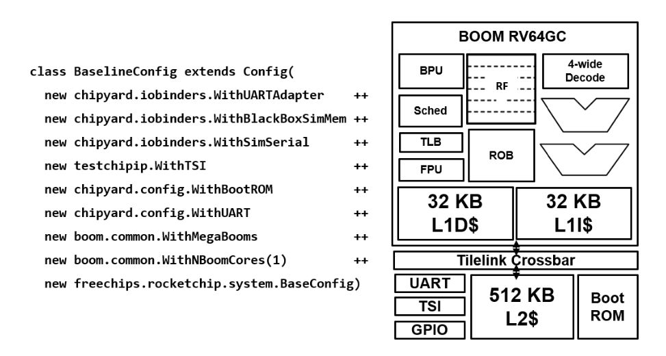
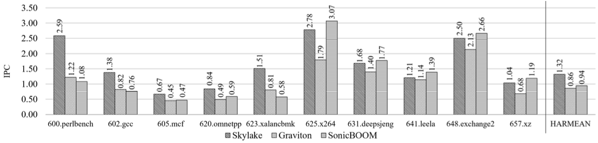
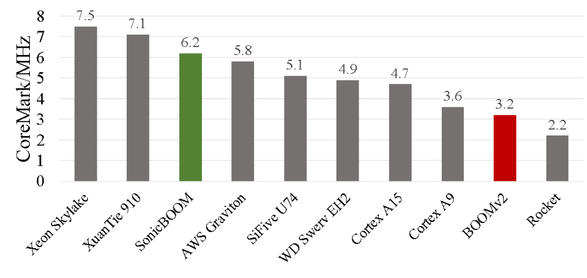

### **SonicBoom: 第三次代OOOプロセッサー**

#### Jerry Zhao, Ben Korpan, Abraham Gonzalez, Krste Asanovic

##### Fourth Workshop on Computer Architecture Research with RISC-V 5, 1-7, 2020

###### 英語論文購読第２回　ヴハイナム

---

# **目次**  

1. 導入
2. BOOM履歴
3. 命令フェッチ
4. 実行
5. ロード・ストアユニットとデータキャッシュ
6. システムサポート
7. 評価
8. 次の課題
9. 結論

---

# 1. 導入

* 高性能スーパースカラーのアウトオブオーダ（OOO）コアがモバイルやエッジ機器へ拡大
* 新しい設計を評価する際にセキュリティ、消費電力、性能、面積を考慮
* スーパースカラーOOOコアのオープンソースハードウェア実装は非常に貴重
* オープンソースハードウェア実装は高性能コアのソフトウェアモデルに対し多数の利点
<!-- * 現代のモバイル／サーバー用のSoCは、フル機能で高性能なスーパースカラーOOOコア実装なしでは不可能 -->
<!--  * 正確なマイクロアーキテクチャの振る舞いを示す -->
<!--  * 実際のアプリケーションを何兆サイクル実行 -->
<!--  * _実証的に_ 消費電力と面積の測定を提供 -->
<!--  * 新しいマイクロアーキテクチャプラットフォームの比較対象を提供 -->
---

* 現在の多くのオープンソースハードウェア開発フレームワークは単純なインオーダコアのみ対応
  * Rocket
  * Ariane
  * Black Parrot
  * PicoRV32  

---

# 2. BOOM履歴

* BOOM Version 1
  * 大学向け教育ツール
  * マイクロプロセッサ MIPS R10K ベース
  (MIPS IV ISA の RISC 実装)
  * パイプライン段数が不足し、  
  **物理的に実現不可能**

---

---

* BOOM Version 2
  * フロントエンドと実行経路にパイプラインを追加
  * 浮動小数点レジスタファイルと実行ユニットを独立パイプラインに分割
  * イシューキューを分離：整数、メモリ、浮動小数点

---

---

* Sonic BOOM
  * より多くの**ソフトウェアスタック**をサポート
  * 性能ボトルネックを修正し、物理的実現性を維持
    * IF
    * EXバックエンド
    * Load / Store
  * クリティカルパス遅延を改善

---

---

* BOOMv3（SonicBOOM）は高性能コア設計の研究のために作られた
* SonicBOOMでは、以下の改善点がある
  * 実施過程 (Execution) の最適化
  * IF の再構築
  * 一サイクルで複数のロードできる  
  ロードストアーユニット
  * SoC と OS サポートが改善された

---

# 3. 命令フェッチ

* 2バイトRVC命令をサポート (通常のRV命令は４バイト)
* TAGE分岐予測器を実装
* 複数の分岐解決ユニット

---

* 一般的な4バイト命令の2バイト形式をサポート  
  * パッケージ化Linuxディストリビューション（Fedora、Debian）向けのデフォルトRV-ISAサブセット
  * 2バイトごとに2/4バイト可能性の命令をデコードする新しいフェッチユニット

---

* 分岐予測器を実装
  * ICache に合わせてバンク化
  * TAGE と RAS を使い予測精度を改善し、関数復帰後のミスを削減
* マルチ分岐解決ユニットで1サイクルに複数の分岐命令を評価

---

# 4. 実行

* RoCC（Rocket Custom Coprocessor）をサポートし、カスタムプロセッサのBOOMパイプライン統合を支援
* 予測困難な分岐を述語付きマイクロオペレーションに再コードしてSFB実装を最適化

---

* Short Forward Branch:
  * 短い基本ブロック上のデータ依存分岐が一般的。これによりミス予測とパイプラインフラッシュの可能性が増加
  * 短い分岐は「set-flag」と「conditional-execute」マイクロオペレーションに変換
  * （例: set.ge マイクロオペレーション）

---

マイクロオペレーション使用で分岐を省略可能  
これによりIPCが**1.7倍**に

---

# 5. ロード・ストアユニットと　データキャッシュ

L1キャッシュの欠点:

* **1ワイドインターフェース** (クロックにつき1個命令しか実施できない) がBOOMのフェッチとデコードパイプラインの  
ボトルネック
* ノン・スペキュレーティブなキャッシュ方式
* キャッシュ追い出し時にロードリフィルがブロック  
これにより置き換えラインの追い出しでサイクル増加

---

* デュアルポーテッドL1データキャッシュ
  * データキャッシュを2バンクに分割  
  各バンクは1R1W SRAM
  * デュアルポーテッドデータキャッシュをサポートするためにロードストアユニットを強化

---

* L1性能を改善
  * キャッシュ追い出しはキャッシュリフィルと並行実行可能。リフィルデータはラインフィルバッファへ書き込み  
  追い出し完了後、ラインフィルバッファはキャッシュ配列へフラッシュ
  * L1とL2間のネクストラインプリフェッチャ  
  ミス後に連続キャッシュラインをラインバッファへ投機的に取得
  * 誤推測リフィルはL1からフラッシュ可能。要求が正しく投機された場合のみL1へ書き込み

---

# 6. システムサポート

* UART、GPIO、JTAG、共有キャッシュメモリシステム、各種アクセラレータなど多くのオープンソースコンポーネントと統合
* Chipyardフレームワークを使えば完全なBOOMベースSoCを生成可能
* SonicBOOMの高速スペキュレーションによりRISC-Vカーネルの重大なデータレースバグを発見

---

SonicBOOMベースSoCは高レベル仕様から作成可能

---

* OOOコアは非常に複雑で、デバッグは困難
  * ユニットテスト：TraceGenとmemtraceでロードストアユニットとデータキャッシュをテスト
  * Dromajoコシミュレーションツール＋FireSim：1MHz以上でコシミュレーションを可能にし、ソフトウェアのみのコシミュレーションより桁違いに高速

---

# 7. 評価

* 使用したテストスイート  

  * CoreMark：文字列操作、行列計算、ハッシュ関数、状態機械などCPU基本タスク。CPU速度テスト  
  * SPECint 2006 CPU：大整数計算性能。実アプリケーションの体系的ストレステスト
  
---

* SPECintテスト：SonicBOOM、Graviton、Skylake３つのプロセッサーの性能評価
  * AWS Graviton：データセンター向けARMベース3ワイドコア
  * Skylake：x86 6ワイドコア
* 合成されたSonicBOOMプロセッサはGravitonと競合。いくつかのベンチマークではSkylakeに匹敵  
  * 625.x264：ビデオ圧縮  
  （H.264/MPEG-4 AVC形式へのビデオストリーム）
  * 631.deepsjeng：人工知能ベンチマーク  
  （ツリー探索とパターン認識）
* 3システム間の**ISA差**がIPCに影響

---

SonicBOOMはGraviton（ARMベース）と比較可能で、一部ベンチマークではSkylake（x86ベース）に匹敵

---

* CoreMarkテスト（アウトオブオーダ性能の評価には適さない）

SonicBOOMは多くの以前のオープンソースコアより高速

---

# 8. 次の課題

1. BOOMでベクターISAのアウトオブオーダ実装
2. L1ミスペナルティ削減
    * 外部メモリプリフェッチャの実装（命令とデータ）

---

# 9. 結論

* BOOMv2の多くの性能ボトルネックを解決
* 新しいマイクロアーキテクチャ最適化を実施
* 実装コアはデータセンター級コアと性能で競合
